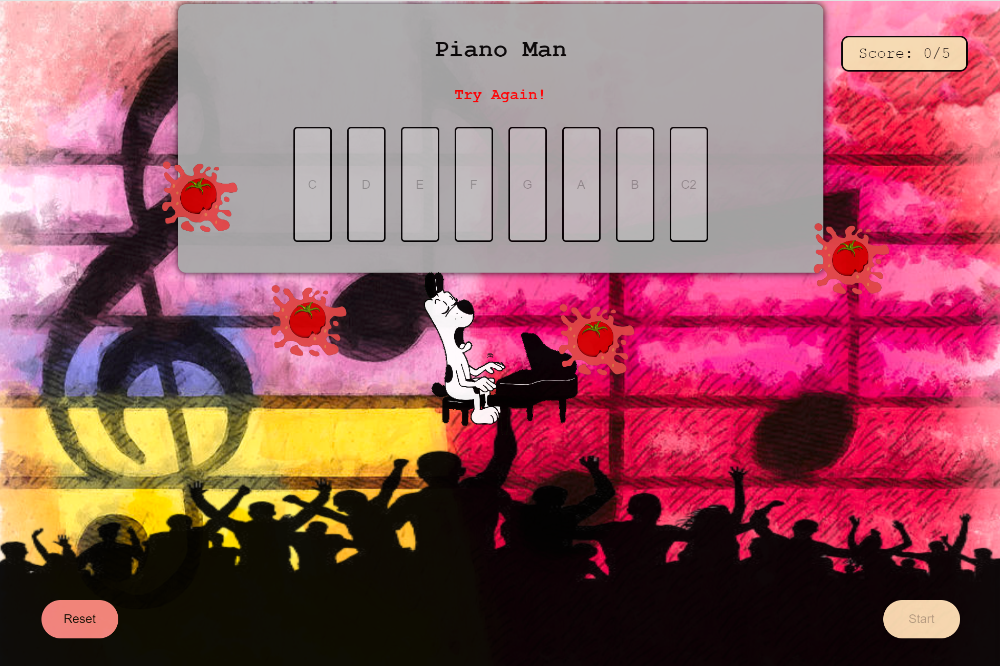

# <PianoMan>
Piano-Man is a music-themed take on the "Simon" game: 
The player will need to match an increasing sequence of notes played by the computer opponent each round. Win 5 rounds to complete the game. If the notes are played incorrectly the computer will reset its sequence to 1 note. 

# Screenshot

# Technologies Used

- JavaScript
- HTML
- CSS

# Getting Started

Play game: https://danaeme.github.io/piano-man-project/

# Next Steps

- Hard mode: add a button that can change the parameters of the game instantly (including mid-game) - increase max score, randomize tempo of the notes played, adding a timer for users to click their sequence...
- Checkpoint system, set progress every 5-10 rounds. 
- Styling to aking it more 'musical' - a 4/4 metronome, visually improving the keyboard to add black keys.

